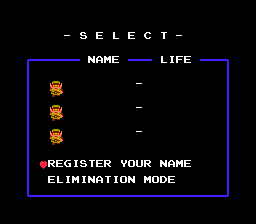
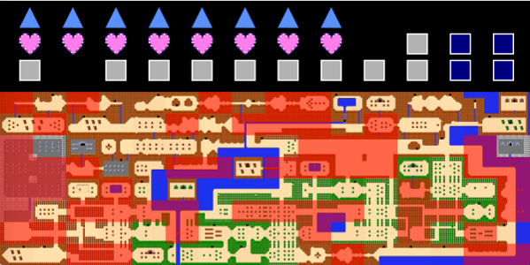

# Description

ZRLogger is an automated tracking tool designed for Zelda Randomizer. As you play through a seed, the program will update in real time and mark caves you've explored, dungeons you've seen, and more. Learn more about Zelda Randomizer at https://sites.google.com/site/zeldarandomizer/

# Usage

A detailed guide to using ZRLogger is given at https://youtu.be/kkKu7nYFQ-Y .
The short story is to open your emulator and wait on the file select screen

Then run ZRLogger.exe and wait for the screen to change from 

to

Then play as you normally would and the program will automatically update.

#Features
The tracker automatically records the following and more:

- Level locations
- Shop locations
- Shop types (candle shop, blue ring shop, etc.)
- Anyroad locations
- White sword and magical sword caves
- Triforce pieces collected in each dungeon
- Heart containers collected in each dungeon
- Items found in staircases in each dungeon
- Number of bonus caves discovered
- Link's current overworld position
- Link's current dungeon position (if in a dungeon)
- Which dungeon rooms Link has already been in
- Which rooms are connected by staircases

#Omissions
The tracker currently does does not record the following (this may change with future updates):

- Armos Item
- Items in drop rooms (in particular one of the two items in level 1 and the item in level 2 are found in drop rooms)
- Ladder Item

#Supported flags
The tracker has been tested most heavliy on and supports the "Tournament" flags and the "Elite 8" flags. In theory the program should work for all first quest flags; however, many combinations remain untested. The tracker also supports custom sprites. In particular you do not need to play as green link.

#Compiling from source
Most users should not need to compile from source as the exectuable ZRLogger.exe comes with the release. However if you do wish compile from source then run CMake on the project directory to create a Visual Studio solution file.

#Contact
If you have any questions or feedback, or if you just want to say hi, feel free to contact me at omnik116@gmail.com
